# Introduction

## About this document

This document aims to help setting up an evaluation procedure with a Sensor Evaluation Kit (SEK) from Sensirion. All available Sensor Evaluation Kits can be found on the [Sensirion website](https://sensirion.com/products/sensor-evaluation/). The document outlines how to get started with the evaluation kit and how to install and use the necessary software.

The software is targeted to application and R&D Engineers who wish to evaluate a Sensirion Sensor within their application.

# Technical Terms

| Term          | Explanation                                                                                                                                                                                                       |
| ------------- | ----------------------------------------------------------------------------------------------------------------------------------------------------------------------------------------------------------------- |
| SEK           | Sensor Evaluation Kit, all available Sensor Evaluation Kits can be found on the [Sensirion website](https://sensirion.com/products/sensor-evaluation/)                                                            |
| SensorBridge  | The hardware component used to connect up to two sensors with the software                                                                                                                                        |
| EDF           | proprietary Sensirion file format for logging measurement values. Compatible with csv reading software such as Microsoft Excel                                                                                    |
| ControlCenter | The Sensor Evaluation Software provided by Sensirion                                                                                                                                                              |
| DataViewer    | The sensor log viewing software provided by Sensirion                                                                                                                                                             |
| VOC Index     | The proprietary Sensirion index to measure VOC concentration changes over a period of time. More information can be found [here](https://sensirion.com/media/documents/02232963/6294E043/Info_Note_VOC_Index.pdf) |
| NOX Index     | The proprietary Sensirion index to measure NOX concentration changes over a period of time. More information can be found [here](https://sensirion.com/media/documents/9F289B95/6294DFFC/Info_Note_NOx_Index.pdf) |
| SHT           | Sensirion Humidity and Temperature Sensor                                                                                                                                                                         |
| STS           | Sensirion Temperature Sensor                                                                                                                                                                                      |
| SCD           | Sensirion CO2 Sensor                                                                                                                                                                                              |
| STC           | Sensirion Thermal Conductivity CO2 Sensor                                                                                                                                                                         |
| SVM           | Sensirion Evaluation Kit for SGP Sensors                                                                                                                                                                          |
| SGP           | Sensirion Mox Sensor to measure VOC and NOX                                                                                                                                                                       |
| SFA           | Sensirion Formaldehyde Sensor                                                                                                                                                                                     |
| SPS           | Sensirion Particulate Matter (PM2.5) Sensor                                                                                                                                                                       |
| SEN           | Sensirion Environnmental Module with multiple sensors                                                                                                                                                             |
| SDP           | Sensirion Differential Pressure Sensor                                                                                                                                                                            |
| SFM           | Sensirion Mass Flow Meter                                                                                                                                                                                         |
| SLF           | Sensirion Liquid Flow Sensor                                                                                                                                                                                      |
| LD            | Sensirion Single-Use Liquid Flow Sensor                                                                                                                                                                           |

# Hardware & System Requirements

## Recommended System Requirements

For optimal usage the minimum recommended system requirements are the following:

- Intel i5 processor or above
- 64 bit OS
- 8 GB of RAM
- 128 GB Hard Drive
- Integrated Graphics or above

### OS Compatibility

- Windows:

  - Windows 11
  - Windows 10
  - Windows 7 (Latest supported ControlCenter version is 1.31.1, **newer** releases do not support this OS version)

- Linux:

  - Ubuntu 18.04 (Up until version 1.37.0, Version 1.38.0 drops support)
  - Ubuntu 20.048
  - Ubuntu 22.04 (First supported ControlCenter version is 1.35.1, **older** releases do not support this OS version)

- MacOS:

  - macOS 13 (Ventura)
  - macOS 12 (Monterey)
  - macOS 11 (Big Sur)
  - macOS 10.14 (Mohave) (Latest supported ControlCenter version is 1.31.1, **newer** releases do not support this OS version)

> [!NOTE]
>
> - For ControlCenter and DataViewer version 1.35.x you need to install following linux packages: _apt install libqt6quickwidgets6 libqt6uitools6_
>
> - ARM processors are not supported. The exception is the Apple Mx series of processors which are compatible with ControlCenter. Sensirion does not guarantee that ControlCenter will work with Raspberry Pi devices running Ubuntu Linux OS

## Supported Sensors

The following Sensor Models are supported by the latest Software release:

| Type                   | Sensor    | SensorBridge Required | Version |
| ---------------------- | --------- | --------------------- | ------- |
| Temperature / Humidity |           |                       |         |
|                        | SHTC1     | Yes                   |         |
|                        | SHTC3     | Yes                   |         |
|                        | SHTW2     | Yes                   |         |
|                        | STH2x     | Yes                   |         |
|                        | SHT3x     | Yes                   |         |
|                        | STS3x     | Yes                   |         |
|                        | STS4x     | Yes                   |         |
|                        | SHT85     | Yes                   |         |
|                        | SHT4x     | Yes                   |         |
|                        | SHT4xIA   | Yes                   |         |
| MOX Gas Sensors        |           |                       |         |
|                        | SGP40     | Yes                   |         |
|                        | SGP41     | Yes                   |         |
| Formaldehyde           |           |                       |         |
|                        | SFA3x     | No                    |         |
| PM2.5                  |           |                       |         |
|                        | SPS3x     | No                    |         |
| CO2                    |           |                       |         |
|                        | SCD3x     | Yes                   |         |
|                        | SCD4x     | Yes                   |         |
|                        | STCC4     | Yes                   |         |
| Differential pressure  |           |                       |         |
|                        | SDP31     | Yes                   |         |
|                        | SDP8xx    | Yes                   |         |
| Gas flow               |           |                       |         |
|                        | SFM6xxx   | No                    |         |
|                        | SFC6xxx   | No                    |         |
|                        | SFM3000   | Yes                   |         |
|                        | SFM3003   | Yes                   |         |
|                        | SFM3013   | Yes                   |         |
|                        | SFM3019   | Yes                   |         |
|                        | SFM3119   | Yes                   |         |
|                        | SFM3200   | Yes                   |         |
|                        | SFM4100   | Yes                   |         |
|                        | SFM4200   | Yes                   |         |
|                        | SFM4300   | Yes                   |         |
|                        | SFM4311   | Yes                   |         |
|                        | SFM3200AW | Yes                   |         |
|                        | SFM3300AW | Yes                   |         |
|                        | SFM3300D  | Yes                   |         |
|                        | SFM3400AW | Yes                   |         |
|                        | SFM3400D  | Yes                   |         |
| Thermal Conductivity   |           |                       |         |
|                        | STC31     | Yes                   |         |
| Liquid Flow            |           |                       |         |
|                        | SLF3S-1300    | No                |         |
|                        | SLF3S-1300D   | No                |         |
|                        | SLF3S-600     | No                |         |
|                        | SLF3S-600D    | No                |         |
|                        | SLF3S-4000B   | No                |         |
|                        | SLF3C-1300F   | No                |         |
|                        | LD20-2600B    | No                |         |
|                        | LD20-0600L    | No                |         |
|                        | SLD3P-0400DM  | No                |         |
|                        | SWT50i    | No                    |         |
| Modules                |           |                       |         |
|                        | SVM3x     | No                    |         |
|                        | SEN4x     | Yes                   |         |
|                        | SEN5x     | Yes                   |         |
|                        | SEN66     | Yes                   |         |
|                        | SEN68     | Yes                   |         |
|                        | SVM4x     | No                    |         |

## Required Hardware

Sensirion provides a variety of Sensor Evaluation Kits for all the different sensor families and models produced. The variety and heterogeneity of the sensors makes it difficult to provide an all-in-one hardware evaluation infrastructure.

Currently the Evaluation Kits are split into two categories:

1.  All-in-one Evaluation Kits with direct USB support
2.  Evaluation Kits requiring a Sensorbridge to communicate with a desktop computer. More information regarding the SensorBridge can be found in a later section.

The table with the supported sensors above outlines the hardware requirements for the different Sensor Evaluation Kits.

## SensorBridge Specifications

### Two Independent Channels Each Offering: 

- I2C bus with speed up to 1Mhz
- SPI bus with CS
- 1.2V - 5.5V selectable supply
- Suitable to deliver up to 250mA @5V
- Analogue in pin (0V - 5V)
- PWM in pin
- Weight with packaging and USB cable: ~140g

### Interface Options

There are two interfaces that can be used. Each implements the SHDLC protocol.

- **USB Virtual Com Port (connector on the right)**  
  This interface offers a fast plug and play option. It is available on every computer and is usually suitable for up to a couple of devices on a normal desktop PC.
- **RS485 (connector on the left)**  
  This interface offers more flexibility in terms of a bus system. Multiple devices can easily be attached to one bus and powered by just one supply. Furthermore, long distances can be achieved by this differential bus interface. To use this, an RS485 interface is required for the computer.

###  Connectors used

1.  **RJ45 (Sensor to Eval Kit)**
    There are two RJ45 connectors each offering the following signals:  
    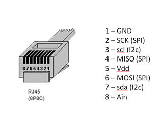
2.  **USB Micro (Eval Kit to Computer)**  
    The USB micro connector is used to do the usual SHDLC communication.  
    
3.  **JST (RS485) - (Eval Kit to Computer)**  
    The standard RS485 connector offers a robust connection with a lock mechanism. The connector offers the RS485 interface.  
    [http://media.digikey.com/photos/JST%20Photos/SM04B-GHS-TB(LF)(SN).jpg](<http://www.google.ch/url?sa=i&rct=j&q=&esrc=s&source=images&cd=&cad=rja&uact=8&ved=0ahUKEwjzqajHt-vPAhUFwxQKHXujDIcQjRwIBw&url=http%3A%2F%2Fwww.digikey.com%2Fproduct-detail%2Fen%2Fjst-sales-america-inc%2FSM04B-GHS-TB(LF)(SN)-%2F455-1566-1-ND%2F807834&psig=AFQjCNEANlLkrkZkAEbv1q-hmJOAuZpUiA&ust=1477123383696065>)

# Getting Started

## Downloading and Installing ControlCenter

To download ControlCenter please visit our website where you can find the latest and previous releases. For customers based in China please use the relevant download links. You can find the link to the website
here: [ControlCenter (sensirion.com)](https://sensirion.com/products/sensor-evaluation/control-center/) ControlCenter is available for Windows, MacOS and Linux Operating Systems. For a complete list of version compatibility please visit the compatibility section of this manual.

### Microsoft Windows installation

Please note that installing ControlCenter requires administrator permissions. Please consult with your IT department in case administrator permissions need to be granted.

To install ControlCenter for Windows please follow the Installation Wizard and install the additional libraries when prompted at the end since they are necessary for the proper communication with SensorBridge.
After installation, ControlCenter can be launched without administrator rights.

### Apple MacOS installation

After downloading the dmg files please follow the Installation Wizard and enter the administrator password when prompted by the Wizard. 
When running the installer, you have to allow executable in the **System Preferences** -> **Security & Privacy** -> **General** tab. Else the installer will not show up.

After installation, ControlCenter can be launched through the applications folder.

### Ubuntu Linux installation

The ControlCenter package for Ubuntu comes with a ready to run application. Simply extract the contents of the compressed folder after download and double click on the ControlCenter executable.

> [!NOTE]
>
> - To have access on the Serial devices over USB, the Ubuntu user needs to be added in the Dialout group. An example command is: _sudo adduser name_of_user dialout_ 
>
> - For Ubuntu Linux 22.04 and ControlCenter and DataViewer version 1.35.x you need to install following linux packages: _apt install libqt6quickwidgets6 libqt6uitools6_

## Connecting a Sensor Evaluation Kit

There are currently two ways to start evaluating a Sensirion sensor with ControlCenter:

- [Connecting a sensor via SensorBridge](#connecting-an-sek-via-sensorbridge)
- [Connecting a sensor directly via USB cable](#connecting-an-sek-via-usb)

Which of the two ways depends on the specific evaluation Kit. Please refer to the Required Hardware section of the manual to determine whether or not SensorBridge is required for the evaluation.

### Connecting an SEK via SensorBridge

To connect an SEK via SensorBridge to your computer follow the next steps:

1.  Use the adapter cable supplied with your SEK and connect it to the female connector on the evaluation board
2.  Connect the RJ45 connector of the adapter cable to either of the two RJ45 ports on the SensorBridge
3.  Use the supplied nano-USB to USB cable to power and connect the SensorBridge to your computer
4.  Launch ControlCenter

### Connecting an SEK via USB

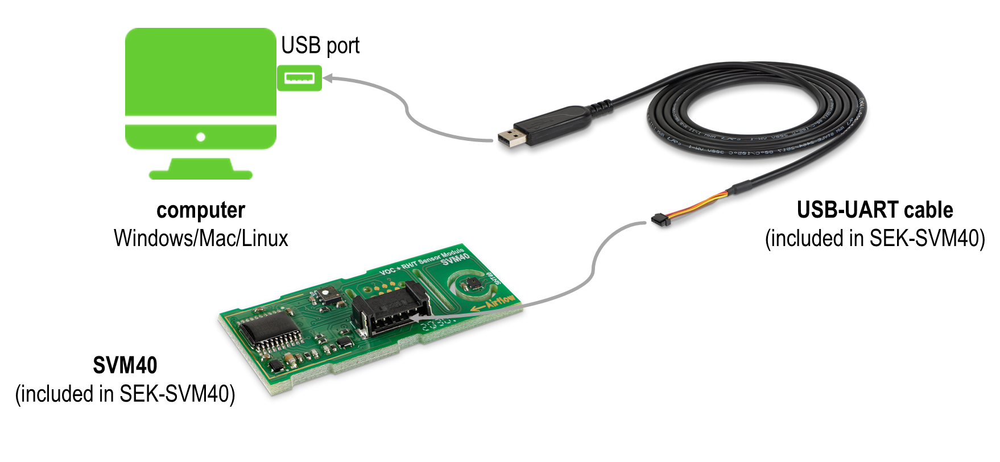

To connect an SEK via USB cable to your computer follow the next steps:

1.  Use the adapter cable supplied with your SEK and connect it to the female connector on the evaluation board
2.  Connect the USB connector of the adapter cable to your computer
3.  Launch ControlCenter

# Using ControlCenter

## Sensor Configuration and Settings

ControlCenter comes with reasonable default configurations for each sensor to start the sensor evaluation.
To further customize sensor configuration you can find the sensor settings as a green gear button in the 'Config' column
next to each connected sensor in the device list.

In the sections below you find the documentation of all available configurations for the following sensors:

- [SHT (Humidity and Temperature)](#humidity-sht)
- [SVM4x/SGP4x (VOC and NOx)](#voc-and-nox-svm4x)
- [SCD30 (CO2)](#scd30-co2-sensor)
- [SCD4x (CO2)](#scd4x-co2-sensor)
- [SPS30 (Particulate Matter)](#particulate-matter-sps30)
- [SFA3x (Formaldehyde)](#formaldehyde-sfa30)
- [SLF3S (Liquid Flow)](#liquid-flow-slf3s-xxxx)
- [SDP3x/SDP8x (Differential Pressure)](#differential-pressure-sdp3x-sdp8x)

> [!NOTE]
>
> **To change the sensor settings or the configuration ControlCenter needs to stop measuring. Please, click the stop button to stop the measurement.**
>
> **An exception to this, are some of the settings of SCD30 which can be adjusted only when the measurement is running**

### Humidity (SHT)

To evaluate the SHT4x you need to connect an SEK-SHT4x. Upon connecting the SHT4x you can:

- Choose a custom name for the sensor which will also be displayed in the plot
- Choose to log less data points in the range of 'every sample' to 'every 10th sample'
- Select the additional signals for Dew Point and Absolute humidity to be shown. Selecting either of the two signals creates an additional tab with the computed signals in the plot section.

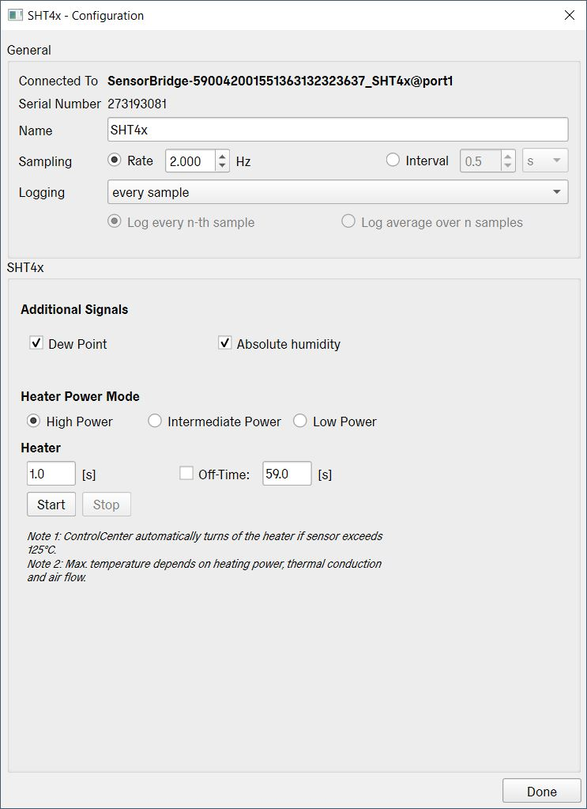

Additionally, there are a number of specific SHT4x settings regarding the heater that the user can select:

- Heater power mode (High/Medium/Low)
- Heater duration and off-time

For more information please refer to the [datasheet of SHT4x](https://sensirion.com/media/documents/33FD6951/639724CA/Sensirion_Datasheet_SHT4x.pdf).

Please Note:

In case you have an SHT3x connected, you have the ability to turn on/off the ART mode on the sensor. With The ART (accelerated response time) feature activated the sensor will start acquiring data with a frequency of 4Hz. The ART feature is reset after a soft or hard reset of the sensor as well as after powering the sensor off. For more information please refer to the [datasheet of SHT3x](https://sensirion.com/media/documents/213E6A3B/61641DC3/Sensirion_Humidity_Sensors_SHT3x_Datasheet_digital.pdf).

### VOC and NOx (SVM4x)

To evaluate the SGP4x you need to connect an SEK-SVM4x. Upon connecting the SVM4x you can:

- Choose a custom name for the sensor which will also be displayed in the plot
- Choose to log less data points in the range of 'every sample' to 'every 10th sample'

Below you can find how to change specific functionalities regarding the VOC Index and the NOx Index

#### Changing the temperature offset

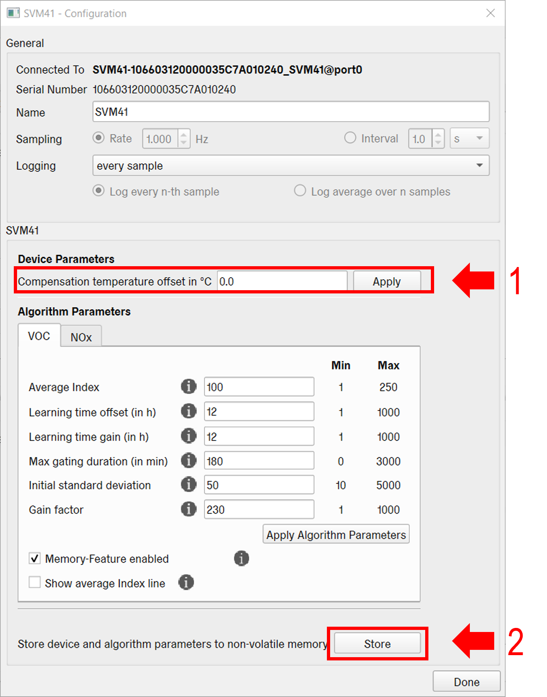

You can change the temperature offset by entering a new value under the Device Parameters section and subsequently pressing the Apply button (1).

You can check if such compensation is needed by comparing the temperature raw value of the SVM4x with the temperature measured by an SHT on an FPCB (e.g., from a SEK-SHTxx) when placing both next to each other. The difference between both sensors is the temperature offset.

If you want the temperature offset to be saved permanently on the SVM4x press the Store button at the bottom (2).

#### Set the tuning parameters for the VOC Index

There are different parameters which can be set by the user to influence the behavior of the VOC Algorithm. For each parameter, you can place the cursor on top of the i icon to receive more information about it (incl. default values in case you forget).

Enter the values in the fields keeping them within Min and Max ranges (1). Feel free to play with the parameters; you cannot destroy anything. Confirm the settings by pressing the Apply Algorithm Parameters button (2).

If you want the tuning parameters to be saved permanently on the SVM4x press the Store button at the bottom (3).

For more information, please, consult the application note [Sensirion's VOC Index for Indoor Air Applications](https://sensirion.com/media/documents/02232963/6294E043/Info_Note_VOC_Index.pdf).

#### Using the memory feature for the VOC Index

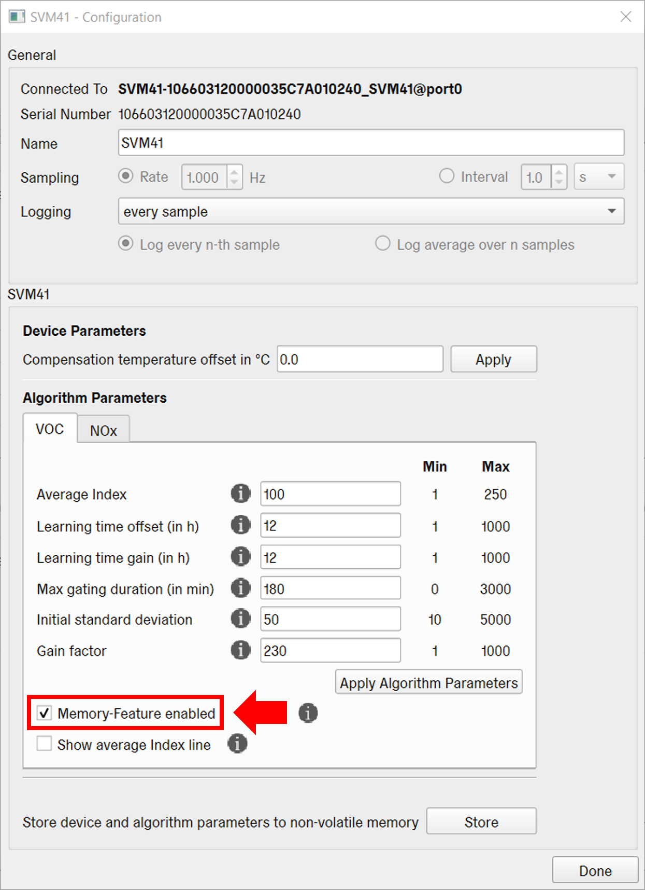

After restart, the VOC Algorithm on the SVM4x normally forgets everything which had been previously learned.

By checking the box next to _Memory-Feature enabled_, the VOC Algorithm remembers previous data and avoids the situation that the algorithm needs to learn from scratch.

Note: this feature must only be used for short interruptions (≤10 min). For more information, please, consult the application note [Sensirion's VOC Index for Indoor Air Applications](https://sensirion.com/media/documents/02232963/6294E043/Info_Note_VOC_Index.pdf).

#### Set the tuning parameters for the NOx Index

There are different parameters which can be set by the user to influence the behavior of the NOx Algorithm. For each parameter, you can place the
cursor on top of the i icon to receive more information about it (incl. default values in case you forget).

Enter the values in the fields keeping them within Min and Max ranges (1). Feel free to play with the parameters; you cannot destroy anything. Confirm the settings by pressing the Apply Algorithm Parameters button(2).

If you want the tuning parameters to be saved permanently on the SVM4x press the Store button at the bottom (3).

For more information, please, consult the application note [Sensirion's NOx Index for Indoor Air Applications](https://sensirion.com/media/documents/9F289B95/6294DFFC/Info_Note_NOx_Index.pdf)

#### Restarting the SVM4x with the new parameters

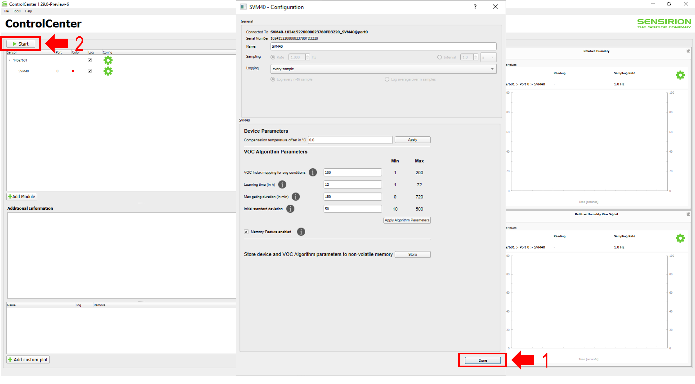

In case you need to transfer a baseline file for a specific SGP sensor to a different computer, you can find it here: C:\\Users\\\<username\>\\Local\\Sensirion\\ControlCenter with the file extension '.json'.

### SCD30 (CO2 Sensor)

To evaluate the SCD3x sensor you need to connect an SEK-SCD3x to a Sensorbridge. Upon connecting the SCD3x you can:

- Choose a custom name for the sensor which will also be displayed in the plot
- Choose to log less data points in the range of 'every sample' to 'every 1000th sample'

Below you can find how to change specific functionalities regarding the ASC (Automatic Self Calibration) and FRC (Forced Recalibration) algorithms

#### ASC and FRC overview

The algorithms ASC and FRC adapt the calibration of the SCD30, which allows for compensation of the sensors' drift over the entire concentration range. Both algorithms require only a single reference value for the desired manipulation. It is important to note that FRC and ASC do not differ in the applied adaption of the calibration -- using the same reference value for ASC and FRC will result in an identical manipulation of the calibration.

The major difference between ASC and FRC is the source of the reference value. FRC requires an input from the host site whereas ASC generates a reference value autonomously from historical sensor data. For calibration in a production line, we recommend to apply FRC after assembly of the device. In applications where the end device is placed in well-ventilated buildings, we recommend to activate ASC to account for potential sensor drifts. If conditions at the end user do not fulfill the requirements necessary for ASC, FRC provides means to mitigate deviations.

You can find more information about the ASC and FRC in the application note [Field calibration for SCD30](https://sensirion.com/media/documents/33C09C07/620638B8/Sensirion_SCD30_Field_Calibration.pdf).

#### Applying a FRC through ControlCenter

For testing purposes, the FRC feature can be executed by using the Sensirion SEK EvalKit by going through the following procedure:

1.  Connect the SCD30 to the SEK EvalKit and start the ControlCenter software.
2.  Open the Setting dialog box of SCD30:
3.  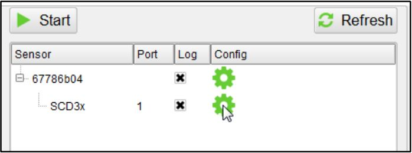
4.  Hit OK and confirm FRC implementation

#### Applying ASC via Sensirion SEK Evaluation Kit

For testing purposes, the ASC feature can be switched on  and off via the Sensirion SEK EvalKit by going through the following procedure:

1.  Connect the SCD30 to the Sensorbridge and start the ControlCenter software.
2.  Open the Setting dialog box of SCD30
3.  Toggle the ASC setting.
4.  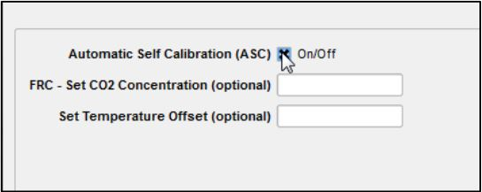

Please note:

Continuous automatic self-calibration can be (de-)activated with the following command. When activated for the first time a period of minimum 7 days is needed so that the algorithm can find its initial parameter set for ASC. The sensor has to be exposed to fresh air for at least 1 hour every day. Also during that period, the sensor may not be disconnected from the power supply, otherwise the procedure to find calibration parameters is aborted and has to be restarted from the beginning. The successfully calculated parameters are stored in non-volatile memory of the SCD30 having the effect that after a restart the previously found parameters for ASC are still present. Note that the most recently found self-calibration parameters will be actively used for self-calibration disregarding the status of this feature. Finding a new parameter set by the here described method will always overwrite the settings from external recalibration and vice-versa. The feature is switched off by default. To work properly SCD30 has to see fresh air on a regular basis. Optimal working conditions are given when the sensor sees fresh air for one hour every day so that ASC can constantly re-calibrate. ASC only works in continuous measurement mode.

The ASC status is saved in non-volatile memory. When the sensor is powered down while ASC is activated SCD30 will continue with automatic self-calibration after repowering without sending the command.

Please find more information regarding the ASC on the [Interface Description Sensirion SCD30 Sensor Module](https://sensirion.com/media/documents/D7CEEF4A/6165372F/Sensirion_CO2_Sensors_SCD30_Interface_Description.pdf).

**Important:**

The source of truth are always the application notes and the datasheets for the sensor. The information provided in this manual is indicative, subject to change and has as a goal to guide the users for the use of the tool,

### SCD4x (CO2 Sensor)

To evaluate the SCD4x sensor you need to connect an SEK-SCD4x to a Sensorbridge. Upon connecting the SCD4x you can:

- Choose a custom name for the sensor which will also be displayed in the plot
- Choose to log less data points in the range of 'every sample' to 'every 1000th sample'

The user can interact with the SCD4x the same way with the SCD3x for the ASC and FRC. Please refer to the SCD3x section for how to turn on/off the ASC and FRC through ControlCenter.

Please note:

For ASC and FRC, ControlCenter sends the commands to the sensor and reads the status from it, this means that the behavior is defined by the sensor and not from ControlCenter. You can find more information regarding the behavior in different modes in the [SCD4x Datasheet](https://sensirion.com/media/documents/E0F04247/631EF271/CD_DS_SCD40_SCD41_Datasheet_D1.pdf) and in the [SCD4x Low Power Operation](https://sensirion.com/media/documents/077BC86F/62BF01B9/CD_AN_SCD4x_Low_Power_Operation_D1.pdf) application note and in the [SCD4x CO2 Sensor Evaluation Kit: Introduction](https://www.youtube.com/watch?v=E-wtyDLzXHY) video.

### Particulate Matter (SPS30)

To evaluate the SPS30 sensor you need to connect an SEK-SPS30 via the supplied USB cable to the laptop. Upon connecting the SPS30 you can:

- Choose a custom name for the sensor which will also be displayed in the plot
- Choose to log less data points in the range of 'every sample' to 'every 1000th sample'
- Switch the auto cleaning 'on/off'
- Choose the auto cleaning interval if auto cleaning is enabled
- Trigger cleaning manually

### Formaldehyde (SFA30)

To evaluate the SFA30 sensor you need to connect an SEK-SFA30 to the measuring computer via the supplied USB to UART cable. Upon connecting the SFA30 you can:

- Choose a custom name for the sensor which will also be displayed in the plot
- Choose to log less data points in the range of 'every sample' to 'every 1000th sample'

Please refer to the [datasheet](https://sensirion.com/media/documents/DEB1C6D6/61654718/Sensirion_Formaldehyde_Sensors_SFA30_Datasheet.pdf) and the [developers\' website](https://developer.sensirion.com/sensirion-products/sfa30-formaldehyde-sensor-module/) for more in depth information.

### Liquid Flow (SLF3S-xxxx)

To evaluate the SLF3S sensor you need to connect the evaluation kit to the measuring computer via the supplied USB cable and the adapter cable as shown in the picture.

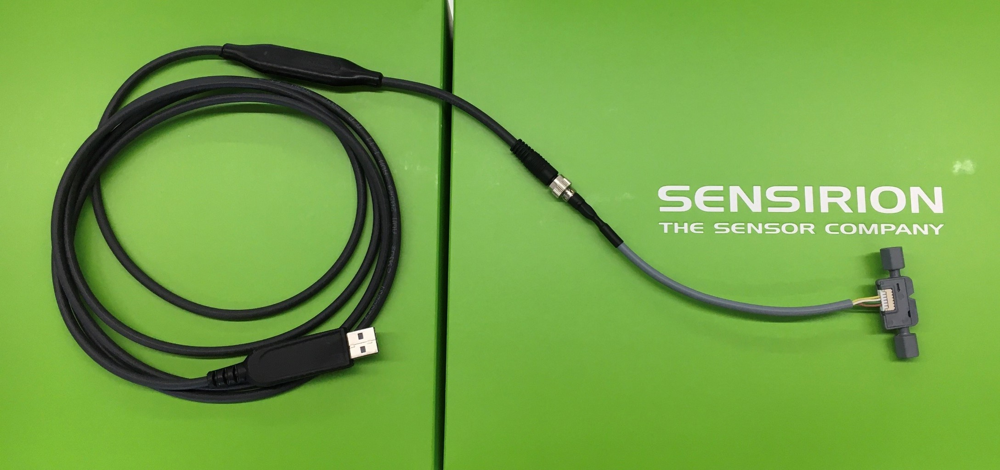

Upon connecting the SLF3s you can:

- Choose a custom name for the sensor which will also be displayed in the plot
- Choose to log less data points in the range of 'every sample' to 'every 1000th sample'
- Select which type of liquid to measure by changing the calibration between water and Isopropyl Alcohol (IPA)

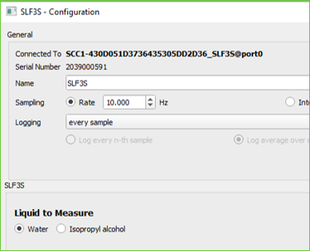

Please refer to the [datasheet](https://sensirion.com/media/documents/C4F8D965/63625D10/Sensirion_Datasheet_SLF3S-0600F.pdf) for more in depth information.

### Differential Pressure (SDP3x, SDP8x)

To evaluate the SDP3x or SDP8x sensor you need to connect an SEK-SDP3x or SEK-SDP8x to the SEK-Sensobridge via the supplied USB to RJ45 cable. Upon connecting the SDP3x/SDP8x you can:

- Choose a custom name for the sensor which will also be displayed in the plot
- Choose to log less data points in the range of 'every sample' to 'every 1000th sample'
- Change the temperature compensation mode from Differential Pressure to Mass flow
- Adjust the mesurement unit

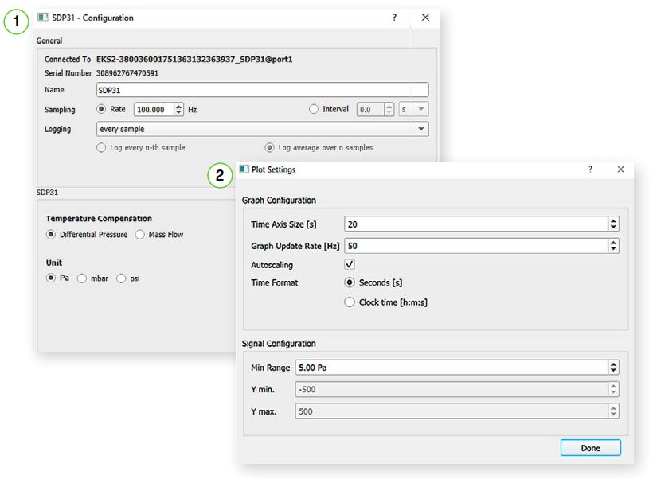

For more information please refer to the datasheets for [SDP3x](https://sensirion.com/media/documents/4D045D69/6375F34F/DP_DS_SDP3x_digital_D1.pdf) and [SDP8x](https://sensirion.com/media/documents/90500156/6167E43B/Sensirion_Differential_Pressure_Datasheet_SDP8xx_Digital.pdf).

## Plots and Plot Interaction

The main functionality of ControlCenter is to visualize the live measurements from the different sensors. This is why the plot section is one of the most important elements of the application and our goal is to create an experience as intuitive as possible.

Upon connecting a sensor via SensorBridge or via a dedicated cable and clicking refresh if ControlCenter is running or launching ControlCenter if it is not running the sensors are automatically identified and a set of predefined plots are generated automatically. The plots are automatically bundled based on the measurement type. For example, when connecting an SCD41 and an SHT40. We see the following plots:

- CO2:

  - SCD41 measurements connected on port 2 of SensorBridge

    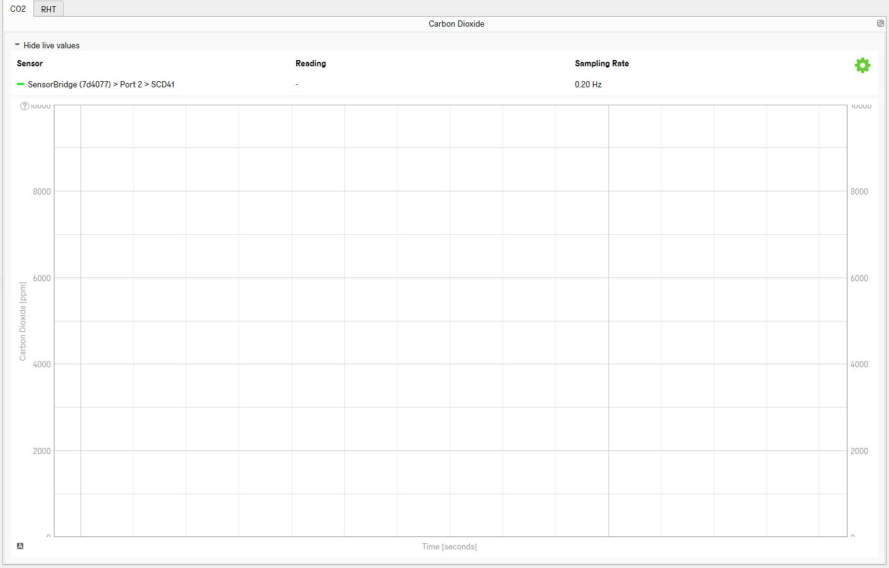

- RHT:

  - Relative Humidity from the SHT4x sensor inside the SCD41
    connected on port 2 of SensorBridge
  - Temperature from the SHT4x sensor inside the SCD41 connected on
    port 2 of SensorBridge
  - Relative Humidity from the SHT4x sensor connected on port 1 of
    SensorBridge
  - Temperature from the SHT4x sensor connected on port 1 of
    SensorBridge

    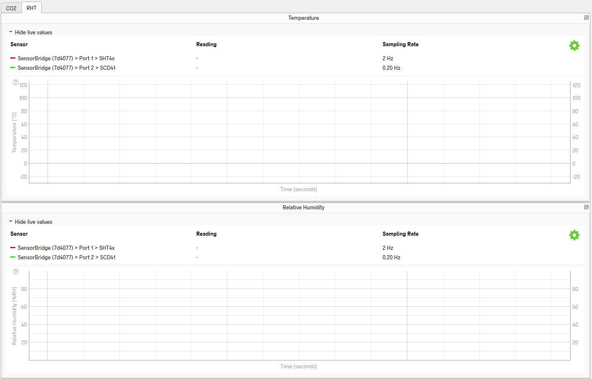

### Plot Settings

On each plot on the top right there is a green cogwheel where the user
can get in the plot settings. The settings might differ slightly per
different signal. The user can:

- Toggle on/off the autoscaling
- Adjust the time format
- Toggle on/off the data value visualization on hovering over the data
- Adjust the minimum range for the y axis of the plot
- Restore the defaults

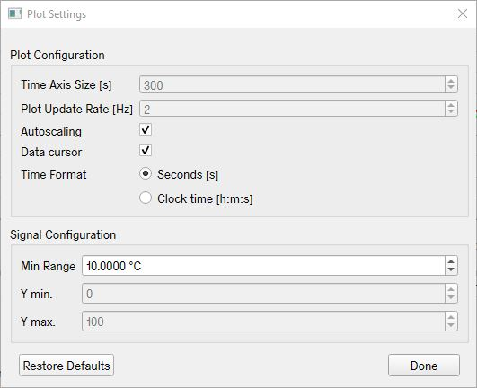

### Plot Interaction

The user interaction regarding plots is very intuitive. ControlCenter
provides a legend to help users familiarize themselves with the
interaction when hovering over the \"?\" icon on the top left of each
plot. The legend shown is the following:

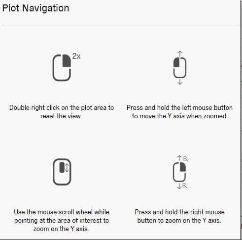

- By double clicking the right mouse button inside the plot area the
  view is reset
- Since the plotting of the measurements is live, the user is
  restricted from going back in time on the x axis
- Using the center mouse wheel, will zoom in/out on the y axis towards
  the area the mouse pointer shows
- The same functionality can be achieved by holding the right mouse
  button and dragging up and down with the mouse
- Moving up and down in a zoomed in plot is done by holding the left
  mouse button and dragging up and down with the mouse

## Custom Plots

As mentioned in earlier sections, the plots in ControlCenter are
automatically generated to make the experience of the user as intuitive
and easy as possible. In addition to the automatically generated plots,
the user has the option to create custom plots by navigating to the
custom plots section on the bottom left of the application.

Upon clicking the button, a pop up window appears to create the custom
plot. The user can select which signals from which sensors will be
displayed on the custom plot as well and add them, as well as create a
name for the custom plot.

Upon creating the plot, a new tab is created with the signals of the
custom plot stacked.

Please note:

The custom plot is persistent between refreshing of the sensors **but not** between restart of the application.

## Logging and Configuration

Apart from visualizing the live plots another main functionality of
ControlCenter as an evaluation tool is to facilitate in the logging of
the measurements for different experiments during the applications.

By default, logging is enabled for all of the sensors and the logging
starts together with the measurement.

The logs are stored in EDF files. The EDF file is a proprietary
Sensirion format modeled out of the CSV format. Therefore it is
compatible with Microsoft Excel and other csv file handling capable
editors.

Under **Settings** -> **Application Settings**, the general ControlCenter
settings can be found. Here you can:

- See in which directory the log files are saved and choose a
  different directory.
- Choose between logging data from each connected sensor into its own
  log file (default) and logging all data from connected sensors into
  one single file.
- Change the temperature between Celsius and Fahrenheit degrees
- Adjust the Plotting line thickness
- Set your preferences regarding update notifications. You can choose between no notification updates, only major versions (default) or all versions.

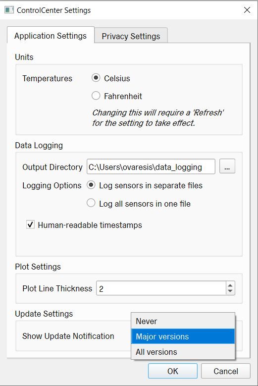

## Support and Feedback

A really important aspect of our mindset at Sensirion is to actively
solve problems of our users, therefore gathering feedback and supporting
our users is of outmost importance to us.

You can provide generic feedback for ControlCenter or request support
through the feedback button located in two places in ControlCenter:

- Under the help menu tab where you can also find the link to this
  manual
- Through the feedback button on the top right corner of the main view
  of ControlCenter

Alternatively you can find the links also here:

- [Provide
  Feedback](https://feedback.echonovum.com/dzWvbG)
- [Report an
  issue](https://feedback.echonovum.com/SnbotU)

If you request any type of additional support please do not hesitate to
contact us by writing a quick note to
[support@sensirion.com](mailto:support@sensirion.com) with the topic 'ControlCenter Feedback'.

# Using DataViewer

Dataviewer is the sister tool of ControlCenter to visualize logged
measurements. Dataviewer can recognize edf files and visualize the
measurements in a grid of plots

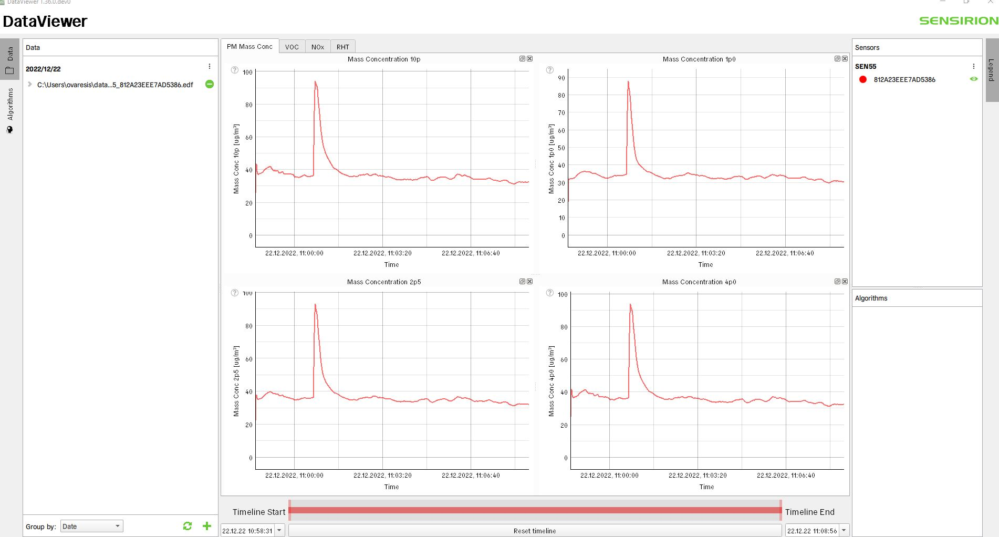

Dataviewer can be accessed as a completely separate program or can be
launched through ControlCenter by clicking the Dataviewer Button on the
left side of the application.

When launched through ControlCenter, DataViewer automatically loads the
current log of measurements.

Over the next sessions, we will go through what are the EDF files, how
to open a log file on DataViewer, How to navigate the plots and we will
finish with a brief explanation of our algorithms processing section of
DataViewer.

## EDF files explained

### Definition of an EDF file

EDF is a (UTF-8 encoded) plain text file modeled after the CSV data
exchange format. It is an internally standardized measurement data
format at Sensirion. You can recognize them by the file ending:
mydatafile.edf. If you use the latest version of Sensirion ControlCenter
all data will be logged in EDF files.

When ignoring the first few metadata lines that are all prefixed with
the hash character (#), the EDF format is fully compatible with CSV
files using the \<tab\> column separator. Sensirion ControlCenter logs
all data as EDF files.

### How to open EDF files

Since EDF files are text files, they can be opened and viewed with any
text editor. If you installed the latest version of Sensirion
ControlCenter on a Windows PC double-clicking EDF files will open it in
Microsoft Excel, provided that Microsoft Excel is installed.

Most data analytics programs that support CSV files will be able to open
or import EDF files when treated as CSV files. In some cases, it might
be necessary to change the file ending from .edf to .csv and/or the
header lines that are prefixed with the hash character (#) must be
removed using a text editor. It is advisable to keep a backup of the
original file before performing those changes.

### EDF file in Excel, wrong numerical values

When opening EDF files with Microsoft Excel the data should be displayed
in a meaningful way, similar to the textual representation of the file.
However, in some cases related to regional/locale settings, Microsoft
Excel misinterprets the data. If your data looks like this it is most
likely due to Excel misinterpreting the decimal separator. EDF always
uses the dot (.) character as decimal separator, which may have a
different meaning in your regional settings. E.g. If your regional
settings use the dot (.) character as thousands-separator, the textual
value  \"24.3202\" (corresponding to a temperature of roughly 24°C
degrees centigrade) will be misinterpreted as 24_320_200. This can be
seen here. There are several solutions to this particular problem:

Solution 1: Import the EDF file with the Text Import Wizard. This
solution will only affect the file you import but not any other files

- Under the advanced option, you can enter \".\" for decimal separator
  and some other symbol for the thousands separator. The thousands
  separator doesn\'t matter because it is not used in EDF files. Just
  make sure that it is different from the decimal separator.
- For more information see the full description of the text import
  wizard on the official Microsoft Office support website.

Solution 2: Change the settings for all Excel files

- This affects all Excel files but not any other office products.
- Follow the step-by-step solution on the official Microsoft Office
  support page or office tooltips.

Solution 3: Change the system settings

- This changes the system default and, in turn, all applications that
  use the system default, e.g. Excel, Word or any other program that
  might rely on it.
- Follow the step by step solution on office tooltips.

## Opening a log file

Opening a log file through DataViewer is very intuitive, it can be
simply done by either double clicking on the edf file itself if
DataViewer is associated with this filetype or if Dataviewer is open you
can use the \"+\" symbol on the bottom left part of the application as
highlighted in the picture

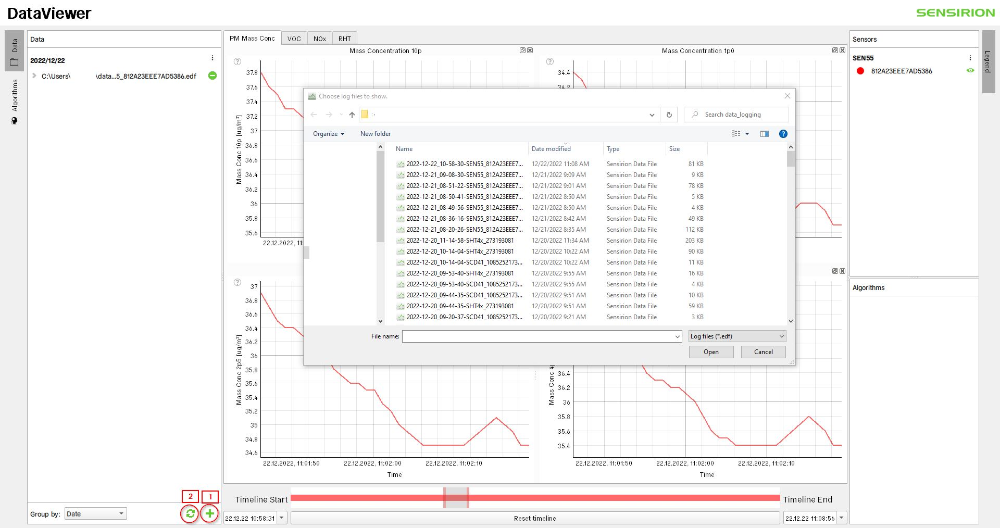
Dataviewer is split in 4 different sections:

1.  Navigation panel
2.  Plot section
3.  Timeline slider
4.  Sensor visualization settings

### Navigation Panel

The active log files sorted by date are shown in the navigation panel.
Upon clicking on a log file you can see the relevant information about
the measurement and the sensor used.

### Plot sections

In this section all the signals present in the measurement file are
plotted in a similar way with ControlCenter. The signals are
automatically assigned to tabs, custom plots are also saved and
visualized if the logging functionality was enabled for them.

More information about the plot interaction can be found in a latter
section.

### Timeline

The timeline bar situated on the bottom of the application is used to
travel between different points in time.  The timeline is in actual date
timestamps to facilitate the user with all the different measurements.

The range of the timeline can be adjusted to by dragging either of the
red bars on each side of the timeline bar. The plots are automatically
adjusted to fit the range of the timeline bar.

In addition as shown in the plot interaction section later on, zooming
in on a plot adjusts the range of the timeline bar accordingly.

### Sensor Visualization Settings

All the sensors present in a measurement as well as the computed
algorithms are shown in this panel.

- By clicking the \"eye\" symbol you can hide/show the measurements
  from a specific sensor
- By clicking on the sensor name you can highlight the measurements
  from this specific sensor by making them bold

## Plot Interaction

The user interaction regarding plots is very intuitive. DataViewer
provides a legend to help users familiarize themselves with the
interaction when hovering over the \"?\" icon on the top left of each
plot. The legend shown is the following:

- Click with the right mouse button the small \"A\" symbol on the
  bottom left side of the plot area to reset the view
- The same functionality can be achieved by right clicking inside the
  plot area. The area resets to the default view
- Zooming in a specific area of interest is done by holding the right
  mouse button and dragging to select the specific area.
- Using the center mouse wheel, will zoom in/out on the y axis towards
  the area the mouse pointer shows
- Panning left and right across the timeline when zoomed in a plot is
  done by holding the left mouse button and dragging left and right
  with the mouse

## Algorithm Processing

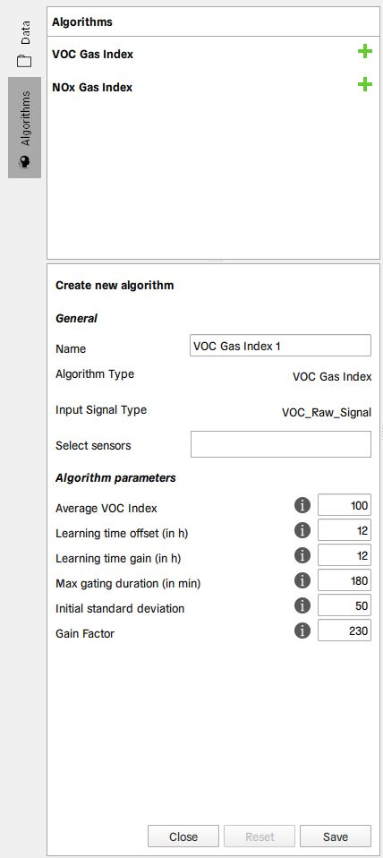

For SEN5x and SGP4x sensors, you can create your own custom algorithms
for VOC and NOx index by clicking the algorithms button in the
navigation panel on the left of the application.

By pressing the \"+\" button you can create virtual VOC index algorithms
with different configuration parameters to tune the sensor in your
specific application.

There are different parameters which can be set by the user to influence
the behavior of the NOx Algorithm. For each parameter, you can place the
cursor on top of the i icon to receive more information about it (incl.
default values in case you forget).

Enter the values in the fields keeping them within Min and Max ranges .
Feel free to play with the parameters; you cannot destroy anything.
Confirm the settings by pressing the save button.

For more information, please, consult the application notes [Sensirion's
VOC Index for Indoor Air
Applications](https://sensirion.com/media/documents/02232963/6294E043/Info_Note_VOC_Index.pdf) and [Sensirion's NOx Index for Indoor Air
Applications](https://sensirion.com/media/documents/9F289B95/6294DFFC/Info_Note_NOx_Index.pdf).

# Appendix

## ControlCenter Releases & Changelog

### Version 1.44

#### Changelog

Features
- Add Support for SGD43s refrigerant leakage detection system
- Add support for STCC4 CO2 sensor
- Add support for SLD3P liquid flow sensor
- Add support for SEN68
- Add VOC/NOx and RH/T compensation options for SEN66

Bugfixes
- Fix issue with detecting SHT3x if they already respond at lower voltages than expected.

#### Links:
- [Windows](https://control-center.sensirion.com/control-center/ControlCenter%20Setup%201.44.0.exe)
- [MacOS](https://control-center.sensirion.com/control-center/ControlCenter_OSX_1.44.0.zip)
- [Ubuntu Linux 20.04](https://control-center.sensirion.com/control-center/ControlCenter_Ubuntu-20.04_1.44.0.zip)
- [Ubuntu Linux 22.04](https://control-center.sensirion.com/control-center/ControlCenter_Ubuntu-22.04_1.44.0.zip)

#### Links China:
- [Windows](https://sensirion-mso.s3.cn-north-1.amazonaws.com.cn/cc/release/ControlCenter%20Setup%201.44.0.exe)
- [MacOS](https://sensirion-mso.s3.cn-north-1.amazonaws.com.cn/cc/release/ControlCenter_OSX_1.44.0.zip)
- [Ubuntu Linux 20.04](https://sensirion-mso.s3.cn-north-1.amazonaws.com.cn/cc/release/ControlCenter_Ubuntu-20.04_1.44.0.zip)
- [Ubuntu Linux 22.04](https://sensirion-mso.s3.cn-north-1.amazonaws.com.cn/cc/release/ControlCenter_Ubuntu-22.04_1.44.0.zip)

### Version 1.43

#### Changelog

Features
- Add support for SEN66
- Remove feedback pop-up

Bugfixes
- Fix crash when removing signals from plot
- Fix crash with STC3x when humidity is negative

#### Links:
- [Windows](https://control-center.sensirion.com/control-center/ControlCenter%20Setup%201.43.0.exe)
- [MacOS](https://control-center.sensirion.com/control-center/ControlCenter_OSX_1.43.0.zip)
- [Ubuntu Linux 20.04](https://control-center.sensirion.com/control-center/ControlCenter_Ubuntu-20.04_1.43.0.zip)
- [Ubuntu Linux 22.04](https://control-center.sensirion.com/control-center/ControlCenter_Ubuntu-22.04_1.43.0.zip)

#### Links China:
- [Windows](https://sensirion-mso.s3.cn-north-1.amazonaws.com.cn/cc/release/ControlCenter%20Setup%201.43.0.exe)
- [MacOS](https://sensirion-mso.s3.cn-north-1.amazonaws.com.cn/cc/release/ControlCenter_OSX_1.43.0.zip)
- [Ubuntu Linux 20.04](https://sensirion-mso.s3.cn-north-1.amazonaws.com.cn/cc/release/ControlCenter_Ubuntu-20.04_1.43.0.zip)
- [Ubuntu Linux 22.04](https://sensirion-mso.s3.cn-north-1.amazonaws.com.cn/cc/release/ControlCenter_Ubuntu-22.04_1.43.0.zip)

### Version 1.42

#### Changelog

Features
- Support for SLF3S-1300D, SLF3S-600D

Bugfixes
- Fix crash on SGP4x settings
- Fix disconnection of SHT4xA when heater is enabled
- Fix Setpoint setting for SFC6xxx when locale is DE

#### Links:
- [Windows](https://control-center.sensirion.com/control-center/ControlCenter%20Setup%201.42.0.exe) 
- [MacOS](https://control-center.sensirion.com/control-center/ControlCenter_OSX_1.42.0.zip) 
- [Ubuntu Linux 20.04](https://control-center.sensirion.com/control-center/ControlCenter_Ubuntu-20.04_1.42.0.zip) 
- [Ubuntu Linux 22.04](https://control-center.sensirion.com/control-center/ControlCenter_Ubuntu-22.04_1.42.0.zip) 

#### Links China:
- [Windows](https://sensirion-mso.s3.cn-north-1.amazonaws.com.cn/cc/release/ControlCenter%20Setup%201.42.0.exe) 
- [MacOS](https://sensirion-mso.s3.cn-north-1.amazonaws.com.cn/cc/release/ControlCenter_OSX_1.42.0.zip) 
- [Ubuntu Linux 20.04](https://sensirion-mso.s3.cn-north-1.amazonaws.com.cn/cc/release/ControlCenter_Ubuntu-20.04_1.42.0.zip) 
- [Ubuntu Linux 22.04](https://sensirion-mso.s3.cn-north-1.amazonaws.com.cn/cc/release/ControlCenter_Ubuntu-22.04_1.42.0.zip)
  
### Version 1.41

#### Changelog
Features
- Add support for SFM3013
- Add support for STC31-C

Bugfixes
- Fix SFC6xxx configuration inputs not being sanity checked
- Fix high refresh rate flow sensor measurement slowing ControlCenter down on refresh
- Fix disconnected sensors not being detected properly
- Fix STC3x sensor settings not persisted

#### Links:
- [Windows](https://control-center.sensirion.com/control-center/ControlCenter%20Setup%201.41.0.exe) 
- [MacOS](https://control-center.sensirion.com/control-center/ControlCenter_OSX_1.41.0.zip) 
- [Ubuntu Linux 20.04](https://control-center.sensirion.com/control-center/ControlCenter_Ubuntu-20.04_1.41.0.zip) 
- [Ubuntu Linux 22.04](https://control-center.sensirion.com/control-center/ControlCenter_Ubuntu-22.04_1.41.0.zip) 

#### Links China:

- [Windows](https://sensirion-mso.s3.cn-north-1.amazonaws.com.cn/cc/release/ControlCenter%20Setup%201.41.0.exe) 
- [MacOS](https://sensirion-mso.s3.cn-north-1.amazonaws.com.cn/cc/release/ControlCenter_OSX_1.41.0.zip) 
- [Ubuntu Linux 20.04](https://sensirion-mso.s3.cn-north-1.amazonaws.com.cn/cc/release/ControlCenter_Ubuntu-20.04_1.41.0.zip) 
- [Ubuntu Linux 22.04](https://sensirion-mso.s3.cn-north-1.amazonaws.com.cn/cc/release/ControlCenter_Ubuntu-22.04_1.41.0.zip)

### Version 1.40

#### Changelog
Features
- Add support for liquid flow sensor LD20-0600L
- Issue reporting is done through a dedicated ticket system 
- Full ControlCenter Support for SWT50i 
- Users can now select whether they want to get notification updates for every ControlCenter release

Bugfixes
- Fix an issue with ControlCenter update notification service
- Fix SFA3x shows values as ppm instead of ppb

#### Links:
- [Windows](https://control-center.sensirion.com/control-center/ControlCenter%20Setup%201.40.2.exe) 
- [MacOS](https://control-center.sensirion.com/control-center/ControlCenter_OSX_1.40.2.zip) 
- [Ubuntu Linux 20.04](https://control-center.sensirion.com/control-center/ControlCenter_Ubuntu-20.04_1.40.2.zip) 
- [Ubuntu Linux 22.04](https://control-center.sensirion.com/control-center/ControlCenter_Ubuntu-22.04_1.40.2.zip) 

#### Links China:

- [Windows](https://sensirion-mso.s3.cn-north-1.amazonaws.com.cn/cc/release/ControlCenter%20Setup%201.40.2.exe) 
- [MacOS](https://sensirion-mso.s3.cn-north-1.amazonaws.com.cn/cc/release/ControlCenter_OSX_1.40.2.zip) 
- [Ubuntu Linux 20.04](https://sensirion-mso.s3.cn-north-1.amazonaws.com.cn/cc/release/ControlCenter_Ubuntu-20.04_1.40.2.zip) 
- [Ubuntu Linux 22.04](https://sensirion-mso.s3.cn-north-1.amazonaws.com.cn/cc/release/ControlCenter_Ubuntu-22.04_1.40.2.zip)

### Version 1.39

#### Changelog
Features
- Add Support for SHT4xIA Analog sensor
- Add support for SCD30 sampling rate

Bugfixes
- Small fixes and improvements

#### Links:
- [Windows](https://control-center.sensirion.com/control-center/ControlCenter%20Setup%201.39.1.exe)
- [MacOS](https://control-center.sensirion.com/control-center/ControlCenter_OSX_1.39.1.zip)
- [Ubuntu Linux 20.04](https://control-center.sensirion.com/control-center/ControlCenter_Ubuntu-20.04_1.39.1.zip)
- [Ubuntu Linux 22.04](https://control-center.sensirion.com/control-center/ControlCenter_Ubuntu-22.04_1.39.1.zip)

#### Links China:

- [Windows](https://sensirion-mso.s3.cn-north-1.amazonaws.com.cn/cc/release/ControlCenter%20Setup%201.39.1.exe)
- [MacOS](https://sensirion-mso.s3.cn-north-1.amazonaws.com.cn/cc/release/ControlCenter_OSX_1.39.1.zip)
- [Ubuntu Linux 20.04](https://sensirion-mso.s3.cn-north-1.amazonaws.com.cn/cc/release/ControlCenter_Ubuntu-20.04_1.39.1.zip)
- [Ubuntu Linux 22.04](https://sensirion-mso.s3.cn-north-1.amazonaws.com.cn/cc/release/ControlCenter_Ubuntu-22.04_1.39.1.zip)

### Version 1.38

#### Changelog
Major Changes
- Drop support for Ubuntu 18.04
Features
- Support alternative sampling frequencies for VOC algorithms in DataViewer
- Add alert simulation feature for SHT3x

Bugfixes
- Fix menu opens on wrong display

#### Links:
- [Windows](https://control-center.sensirion.com/control-center/ControlCenter%20Setup%201.38.0.exe) 
- [MacOS](https://control-center.sensirion.com/control-center/ControlCenter_OSX_1.38.0.zip) 
- [Ubuntu Linux 20.04](https://control-center.sensirion.com/control-center/ControlCenter_Ubuntu-20.04_1.38.0.zip) 
- [Ubuntu Linux 22.04](https://control-center.sensirion.com/control-center/ControlCenter_Ubuntu-22.04_1.38.0.zip) 

#### Links China:

- [Windows](https://sensirion-mso.s3.cn-north-1.amazonaws.com.cn/cc/release/ControlCenter%20Setup%201.38.0.exe) 
- [MacOS](https://sensirion-mso.s3.cn-north-1.amazonaws.com.cn/cc/release/ControlCenter_OSX_1.38.0.zip) 
- [Ubuntu Linux 20.04](https://sensirion-mso.s3.cn-north-1.amazonaws.com.cn/cc/release/ControlCenter_Ubuntu-20.04_1.38.0.zip) 
- [Ubuntu Linux 22.04](https://sensirion-mso.s3.cn-north-1.amazonaws.com.cn/cc/release/ControlCenter_Ubuntu-22.04_1.38.0.zip)

### Version 1.37

#### Changelog
Internal changes and bugfixes

#### Links:
- [Windows](https://control-center.sensirion.com/control-center/ControlCenter%20Setup%201.37.0.exe) 
- [MacOS](https://control-center.sensirion.com/control-center/ControlCenter_OSX_1.37.0.zip) 
- [Ubuntu Linux 18.04](https://control-center.sensirion.com/control-center/ControlCenter_Ubuntu-18.04_1.37.0.zip) 
- [Ubuntu Linux 20.04](https://control-center.sensirion.com/control-center/ControlCenter_Ubuntu-20.04_1.37.0.zip) 
- [Ubuntu Linux 22.04](https://control-center.sensirion.com/control-center/ControlCenter_Ubuntu-22.04_1.37.0.zip) 

#### Links China:

- [Windows](https://sensirion-mso.s3.cn-north-1.amazonaws.com.cn/cc/release/ControlCenter%20Setup%201.37.0.exe) 
- [MacOS](https://sensirion-mso.s3.cn-north-1.amazonaws.com.cn/cc/release/ControlCenter_OSX_1.37.0.zip) 
- [Ubuntu Linux 18.04](https://sensirion-mso.s3.cn-north-1.amazonaws.com.cn/cc/release/ControlCenter_Ubuntu-18.04_1.37.0.zip) 
- [Ubuntu Linux 20.04](https://sensirion-mso.s3.cn-north-1.amazonaws.com.cn/cc/release/ControlCenter_Ubuntu-20.04_1.37.0.zip) 
- [Ubuntu Linux 22.04](https://sensirion-mso.s3.cn-north-1.amazonaws.com.cn/cc/release/ControlCenter_Ubuntu-22.04_1.37.0.zip) 

### Version 1.36

#### Changelog
Features
- Allow users to provide feedback for ControlCenter
- Support for SDP33
- Show single data point for plots on hover (only when measurement is stopped)
- Plot configuration is persisted
- Add plot grid to ControlCenter

Bugfixes
- ControlCenter for Ubuntu 22.04 runs without installing additional packages
- Fix issue with multiple flow sensors attached

#### Links:
- [Windows](https://control-center.sensirion.com/control-center/ControlCenter%20Setup%201.36.0.exe) 
- [MacOS](https://control-center.sensirion.com/control-center/ControlCenter_OSX_1.36.0.zip) 
- [Ubuntu Linux 18.04](https://control-center.sensirion.com/control-center/ControlCenter_Ubuntu-18.04_1.36.0.zip) 
- [Ubuntu Linux 20.04](https://control-center.sensirion.com/control-center/ControlCenter_Ubuntu-20.04_1.36.0.zip) 
- [Ubuntu Linux 22.04](https://control-center.sensirion.com/control-center/ControlCenter_Ubuntu-22.04_1.36.0.zip) 

#### Links China:

- [Windows](https://sensirion-mso.s3.cn-north-1.amazonaws.com.cn/cc/release/ControlCenter%20Setup%201.36.0.exe) 
- [MacOS](https://sensirion-mso.s3.cn-north-1.amazonaws.com.cn/cc/release/ControlCenter_OSX_1.36.0.zip) 
- [Ubuntu Linux 18.04](https://sensirion-mso.s3.cn-north-1.amazonaws.com.cn/cc/release/ControlCenter_Ubuntu-18.04_1.36.0.zip) 
- [Ubuntu Linux 20.04](https://sensirion-mso.s3.cn-north-1.amazonaws.com.cn/cc/release/ControlCenter_Ubuntu-20.04_1.36.0.zip) 
- [Ubuntu Linux 22.04](https://sensirion-mso.s3.cn-north-1.amazonaws.com.cn/cc/release/ControlCenter_Ubuntu-22.04_1.36.0.zip) 

### Version 1.35.1
> [!NOTE]
>
> For ControlCenter and DataViewer version 1.35.x you need to install following linux packages: _apt install libqt6quickwidgets6 libqt6uitools6_

#### Changelog
Features

- Add support for Ubuntu 22.04 LTS
- Add support for SFM3304 with Nicolay Cable

Bugfixes
- Fix issue with bold fonts not correctly showing on some Windows and OSX computers
- Fix issue of SCD4x settings not updated in view after factory update

#### Links:
- [Windows](https://control-center.sensirion.com/control-center/ControlCenter%20Setup%201.35.1.exe) 
- [MacOS](https://control-center.sensirion.com/control-center/ControlCenter_OSX_1.35.1.zip) 
- [Ubuntu Linux 18.04](https://control-center.sensirion.com/control-center/ControlCenter_Ubuntu-18.04_1.35.1.zip) 
- [Ubuntu Linux 20.04](https://control-center.sensirion.com/control-center/ControlCenter_Ubuntu-20.04_1.35.1.zip) 
- [Ubuntu Linux 22.04](https://control-center.sensirion.com/control-center/ControlCenter_Ubuntu-22.04_1.35.1.zip) 

#### Links China:

- [Windows](https://sensirion-mso.s3.cn-north-1.amazonaws.com.cn/cc/release/ControlCenter%20Setup%201.35.1.exe) 
- [MacOS](https://sensirion-mso.s3.cn-north-1.amazonaws.com.cn/cc/release/ControlCenter_OSX_1.35.1.zip) 
- [Ubuntu Linux 18.04](https://sensirion-mso.s3.cn-north-1.amazonaws.com.cn/cc/release/ControlCenter_Ubuntu-18.04_1.35.1.zip) 
- [Ubuntu Linux 20.04](https://sensirion-mso.s3.cn-north-1.amazonaws.com.cn/cc/release/ControlCenter_Ubuntu-20.04_1.35.1.zip) 
- [Ubuntu Linux 22.04](https://sensirion-mso.s3.cn-north-1.amazonaws.com.cn/cc/release/ControlCenter_Ubuntu-22.04_1.35.1.zip) 

### Version 1.34

#### Changelog
Features

- Improved ControlCenter App Menu for better navigation
- Added the ability to persistently change - - Plot line thickness in ControlCenter settings
- Visual improvements on fonts for ControlCenter and DataViewer
- Improved the data management for DataViewer
- Added group operation support for DataViewer such as:
  - remove all
  - show/hide all
  - highlight/unhighlight all

Bugfixes
- Fix issue when device is lost, entries are duplicated
- Fix crash on Ubuntu when SensorBridge with new PID/VID is connected for the first time

#### Links:
- [Windows](https://control-center.sensirion.com/control-center/ControlCenter%20Setup%201.34.0.exe) 
- [MacOS](https://control-center.sensirion.com/control-center/ControlCenter_OSX_1.34.0.zip) 
- [Ubuntu Linux 18.04](https://control-center.sensirion.com/control-center/ControlCenter_Ubuntu-18.04_1.34.0.zip) 
- [Ubuntu Linux 20.04](https://control-center.sensirion.com/control-center/ControlCenter_Ubuntu-20.04_1.34.0.zip) 

#### Links China:

- [Windows](https://sensirion-mso.s3.cn-north-1.amazonaws.com.cn/cc/release/ControlCenter%20Setup%201.34.0.exe) 
- [MacOS](https://sensirion-mso.s3.cn-north-1.amazonaws.com.cn/cc/release/ControlCenter_OSX_1.34.0.zip) 
- [Ubuntu Linux 18.04](https://sensirion-mso.s3.cn-north-1.amazonaws.com.cn/cc/release/ControlCenter_Ubuntu-18.04_1.34.0.zip) 
- [Ubuntu Linux 20.04](https://sensirion-mso.s3.cn-north-1.amazonaws.com.cn/cc/release/ControlCenter_Ubuntu-20.04_1.34.0.zip) 

### Version 1.33.1

#### Changelog
Features

- Add Support for SFM4300-50 product line
- Improved tooltips in the sensor configuration window
- UI and Plot Improvements in DataViewer
  - Improve legends
  - Replace Sensor by Data tab
- Only supported I2C frequencies can be selected in device configuration for ControlCenter

Bugfixes
- Fix read-out of serial number for SDP products
- Probing for Nicolay cable
- Do no show disconnect warning on firmware update
- Consistent tabs between ControlCenter and DataViewer

#### Links:
- [Windows](https://control-center.sensirion.com/control-center/ControlCenter%20Setup%201.33.1.exe) 
- [MacOS](https://control-center.sensirion.com/control-center/ControlCenter_OSX_1.33.1.zip) 
- [Ubuntu Linux 18.04](https://control-center.sensirion.com/control-center/ControlCenter_Ubuntu-18.04_1.33.1.zip) 
- [Ubuntu Linux 20.04](https://control-center.sensirion.com/control-center/ControlCenter_Ubuntu-20.04_1.33.1.zip) 

#### Links China:

- [Windows](https://sensirion-mso.s3.cn-north-1.amazonaws.com.cn/cc/release/ControlCenter%20Setup%201.33.1.exe) 
- [MacOS](https://sensirion-mso.s3.cn-north-1.amazonaws.com.cn/cc/release/ControlCenter_OSX_1.33.1.zip) 
- [Ubuntu Linux 18.04](https://sensirion-mso.s3.cn-north-1.amazonaws.com.cn/cc/release/ControlCenter_Ubuntu-18.04_1.33.1.zip) 
- [Ubuntu Linux 20.04](https://sensirion-mso.s3.cn-north-1.amazonaws.com.cn/cc/release/ControlCenter_Ubuntu-20.04_1.33.1.zip) 

### Version 1.32.1

#### Changelog
Features:

- Add signal units on DataViewer plots
- Support persistence of algorithm parameters in DataViewer
- Make DataViewer plots not consistent with ControlCenter

Bugfixes
- Fix zoom and resize issues in DataViewer
- Increase supported accuracy for plot auto-scale to 4 digits
- Fix double validator in sensor settings broken with German language settings
- Fix SFM4100 insufficient probing issue. This caused several SFM4100 products to show up when a defective sensor is connected
- Fix Nicolay cable not always detected on OSX and Linux

#### Links:
- [Windows](https://control-center.sensirion.com/control-center/ControlCenter%20Setup%201.32.1.exe) 
- [MacOS](https://control-center.sensirion.com/control-center/ControlCenter_OSX_1.32.1.zip) 
- [Ubuntu Linux 18.04](https://control-center.sensirion.com/control-center/ControlCenter_Ubuntu-18.04_1.32.1.zip) 
- [Ubuntu Linux 20.04](https://control-center.sensirion.com/control-center/ControlCenter_Ubuntu-20.04_1.32.1.zip) 

#### Links China:

- [Windows](https://sensirion-mso.s3.cn-north-1.amazonaws.com.cn/cc/release/ControlCenter%20Setup%201.32.1.exe) 
- [MacOS](https://sensirion-mso.s3.cn-north-1.amazonaws.com.cn/cc/release/ControlCenter_OSX_1.32.1.zip) 
- [Ubuntu Linux 18.04](https://sensirion-mso.s3.cn-north-1.amazonaws.com.cn/cc/release/ControlCenter_Ubuntu-18.04_1.32.1.zip) 
- [Ubuntu Linux 20.04](https://sensirion-mso.s3.cn-north-1.amazonaws.com.cn/cc/release/ControlCenter_Ubuntu-20.04_1.32.1.zip) 

### Version 1.31.1

#### Changelog
Features:
- SEN5x Firmware 1.0 support with all VOC, NOx and RH/T engine parameters
- Add support for all SDP31 and SDP8x products and I2C addresses
- Add support for SGD41 in ControlCenter
- Support SLF3S-4000B
- SVM41 startup-spinner and improved firmware upgrade

Bugfixes:
- DataViewer VOC/NOx algorithm tuning support
- Keep zoom level on add algorithm or data
- Keep signals hidden when adding algorithm
- Fix reset timeline button

#### Links:
- [Windows](https://control-center.sensirion.com/control-center/ControlCenter%20Setup%201.31.1.exe) 
- [MacOS](https://control-center.sensirion.com/control-center/ControlCenter_OSX_1.31.1.zip) 
- [Ubuntu Linux 18.04](https://control-center.sensirion.com/control-center/ControlCenter_Ubuntu-18.04_1.31.1.zip) 
- [Ubuntu Linux 20.04](https://control-center.sensirion.com/control-center/ControlCenter_Ubuntu-20.04_1.31.1.zip) 

#### Links China:

- [Windows](https://sensirion-mso.s3.cn-north-1.amazonaws.com.cn/cc/release/ControlCenter%20Setup%201.31.1.exe) 
- [MacOS](https://sensirion-mso.s3.cn-north-1.amazonaws.com.cn/cc/release/ControlCenter_OSX_1.31.1.zip) 
- [Ubuntu Linux 18.04](https://sensirion-mso.s3.cn-north-1.amazonaws.com.cn/cc/release/ControlCenter_Ubuntu-18.04_1.31.1.zip) 
- [Ubuntu Linux 20.04](https://sensirion-mso.s3.cn-north-1.amazonaws.com.cn/cc/release/ControlCenter_Ubuntu-20.04_1.31.1.zip) 

## SEK Part Numbers
